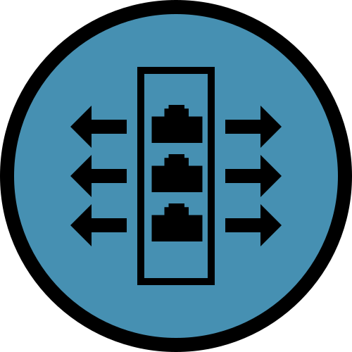

<a id="readme-top"></a>

[![MIT License][license-shield]][license-url]
[![LinkedIn][linkedin-shield]][linkedin-url]
[![X][x-follow-shield]][x-follow-url]
<br />
<br />
<br />
<div align="center">
  <a href="https://github.com/shikharbhargava/raw-packet-eth-win">
    
  </a>
  <h3 align="center">Raw Ethernet Packet Generator</h3>

  <p align="center">
    Raw Ethernet Packet Generator is a CLI packet generator tool for ethernet on Windows 10/11. It allows you to create and send any possible packet or sequence of packets on the ethernet link. It is very simple to use, powerful and supports many adjustments of parameters while sending. 
    <br />
    <a href="https://github.com/shikharbhargava/raw-packet-eth-win"><strong>Explore the docs »</strong></a>
    <br />
    <br />
    <a href="https://github.com/shikharbhargava/raw-packet-eth-win">View Demo</a>
    ·
    <a href="https://github.com/shikharbhargava/raw-packet-eth-win/issues/new?labels=bug&template=bug-report---.md">Report Bug</a>
    ·
    <a href="https://github.com/shikharbhargava/raw-packet-eth-win/issues/new?labels=enhancement&template=feature-request---.md">Request Feature</a>
  </p>
</div>


<!-- TABLE OF CONTENTS -->
<details>
  <summary>Table of Contents</summary>
  <ol>
    <li>
      <a href="#about-the-project">About The Project</a>
      <ul>
        <li><a href="#built-with">Built With</a></li>
      </ul>
    </li>
    <li>
      <a href="#getting-started">Getting Started</a>
      <ul>
        <li><a href="#prerequisites">Prerequisites</a></li>
        <li><a href="#installation">Installation</a></li>
      </ul>
    </li>
    <li><a href="#usage">Usage</a></li>
    <li><a href="#roadmap">Roadmap</a></li>
    <li><a href="#contributing">Contributing</a></li>
    <li><a href="#license">License</a></li>
    <li><a href="#contact">Contact</a></li>
    <li><a href="#acknowledgments">Acknowledgments</a></li>
  </ol>
</details>


<!-- ABOUT THE PROJECT -->
## About The Project

[![Raw Ethernet Packet Generator Screen Shot][product-screenshot]](images/screenshot.png)

This utility can be used to generate raw Ethernet ([Ethernet II](https://en.wikipedia.org/wiki/Ethernet_frame#Ethernet_II)) frames on a specefied interface. Following are the ways to generate the packets:

1. &emsp;Ethernet frame with specefied source mac address, destination mac address, [EtherType](https://en.wikipedia.org/wiki/EtherType) and payload byte stream.
```ssh
python raw-packet-eth.py -i INTERFACE-NAME -s SRC-MAC-ADDRESS -d DST-MAC-ADDRESS -e ETHER-TYPE -p PAYLOAD-HEX-STREAM
```
Example : <a href="https://en.wikipedia.org/wiki/GOOSE" target="_blank">**GOOSE**</a> Packet (EtherType ***0x88b8***) from ***00-15-5D-93-03-30*** to ***00-15-5D-D6-7F-8A***
```ssh
python raw-packet-eth.py -i "Ethernet 1" -s 00-15-5D-93-03-30 -d 00-15-5D-D6-7F-8A -e 0x88b8 -p 0001008c00000000618181801742455353314346472f4c4c4e3024474f24424553535f31810207d0821e42455353314346472f4c4c4e3024424553535f6d6561737572656d656e748306424553535f31840863dc512ca51e64c485030297188601008701008801018901008a0103ab1c870680f901fbd71e870882ffffe801000000870882ffffe801000000
```
In the above example, if the source mac address of the specified interface is to be used source mac address can be sipped.
```ssh
python raw-packet-eth.py -i INTERFACE-NAME -d DST-MAC-ADDRESS -e ETHER-TYPE -p PAYLOAD-HEX-STREAM
```
Similarly, if the destination mac address is not known and the destination machine is IP-capable and supports ARP then destination IP address can also be provided.
```ssh
python raw-packet-eth.py -i INTERFACE-NAME -D DST-IP-ADDRESS -e ETHER-TYPE -p PAYLOAD-HEX-STREAM
```


<p align="right">(<a href="#readme-top">back to top</a>)</p>


### Built With

This section should list any major frameworks/libraries used to bootstrap your project. Leave any add-ons/plugins for the acknowledgements section. Here are a few examples.

[![Python][Python]][Python-url]

<p align="right">(<a href="#readme-top">back to top</a>)</p>


<!-- GETTING STARTED -->
## Getting Started

This is an example of how you may give instructions on setting up your project locally.
To get a local copy up and running follow these simple example steps.

### Prerequisites

This is an example of how to list things you need to use the software and how to install them.
* npm
  ```sh
  npm install npm@latest -g
  ```

### Installation

_Below is an example of how you can instruct your audience on installing and setting up your app. This template doesn't rely on any external dependencies or services._

1. Get a free API Key at [https://example.com](https://example.com)
2. Clone the repo
   ```sh
   git clone https://github.com/your_username_/Project-Name.git
   ```
3. Install NPM packages
   ```sh
   npm install
   ```
4. Enter your API in `config.js`
   ```js
   const API_KEY = 'ENTER YOUR API';
   ```

<p align="right">(<a href="#readme-top">back to top</a>)</p>


<!-- USAGE EXAMPLES -->
## Usage

Use this space to show useful examples of how a project can be used. Additional screenshots, code examples and demos work well in this space. You may also link to more resources.

_For more examples, please refer to the [Documentation](/documentation/index.html)_

<p align="right">(<a href="#readme-top">back to top</a>)</p>


<!-- ROADMAP -->
## Roadmap

***TBD***

See the [open issues](https://github.com/shikharbhargava/raw-packet-eth-win/issues) for a full list of proposed features (and known issues).

<p align="right">(<a href="#readme-top">back to top</a>)</p>


<!-- CONTRIBUTING -->
## Contributing

Contributions are what make the open source community such an amazing place to learn, inspire, and create. Any contributions you make are **greatly appreciated**.

If you have a suggestion that would make this better, please fork the repo and create a pull request. You can also simply open an issue with the tag "enhancement".
Don't forget to give the project a star! Thanks again!

1. Fork the Project
2. Create your Feature Branch (`git checkout -b feature/AmazingFeature`)
3. Commit your Changes (`git commit -m 'Add some AmazingFeature'`)
4. Push to the Branch (`git push origin feature/AmazingFeature`)
5. Open a Pull Request

<p align="right">(<a href="#readme-top">back to top</a>)</p>


<!-- LICENSE -->
## License

Distributed under the MIT License. See [`MIT-License.txt`](MIT-License.txt) for more information.

<p align="right">(<a href="#readme-top">back to top</a>)</p>


<!-- CONTACT -->
## Contact

Shikhar Bhargava - [![X][x-tweet-shield]][x-tweet-url]

Project Link: [https://github.com/shikharbhargava/raw-packet-eth-win](https://github.com/shikharbhargava/raw-packet-eth-win)

<p align="right">(<a href="#readme-top">back to top</a>)</p>


<!-- MARKDOWN LINKS & IMAGES -->
<!-- https://www.markdownguide.org/basic-syntax/#reference-style-links -->
[contributors-shield]: https://img.shields.io/github/contributors/shikharbhargava/Best-README-Template.svg?style=for-the-badge
[contributors-url]: https://github.com/shikharbhargava/raw-packet-eth-win/graphs/contributors
[forks-shield]: https://img.shields.io/github/forks/shikharbhargava/Best-README-Template.svg?style=for-the-badge
[forks-url]: https://github.com/shikharbhargava/raw-packet-eth-win/network/members
[stars-shield]: https://img.shields.io/github/stars/shikharbhargava/Best-README-Template.svg?style=for-the-badge
[stars-url]: https://github.com/shikharbhargava/raw-packet-eth-win/stargazers
[issues-shield]: https://img.shields.io/github/issues/shikharbhargava/Best-README-Template.svg?style=for-the-badge
[issues-url]: https://github.com/shikharbhargava/raw-packet-eth-win/issues
[license-shield]: https://img.shields.io/github/license/shikharbhargava/raw-packet-eth-win?style=for-the-badge
[license-url]: MIT-License.txt
[linkedin-shield]: https://img.shields.io/badge/LinkedIn-0077B5?style=for-the-badge&logo=linkedin&logoColor=white
[linkedin-url]: https://linkedin.com/in/shikharbhargava
[x-follow-shield]: https://img.shields.io/twitter/follow/shikharbhargava?style=for-the-badge
[x-follow-url]: https://x.com/intent/follow?screen_name=shikharbhargava
[x-tweet-shield]: https://img.shields.io/twitter/url?url=https%3A%2F%2Fx.com%2Fshikharbhargava&style=social&label=TWEET%20%40shikharbhargava
[x-tweet-url]: https://x.com/intent/post?text=Wow%3A&url=https%3A%2F%2Fx.com%2Fshikharbhargava
[product-screenshot]: images/screenshot.png
[Next.js]: https://img.shields.io/badge/next.js-000000?style=for-the-badge&logo=nextdotjs&logoColor=white
[Next-url]: https://nextjs.org/
[React.js]: https://img.shields.io/badge/React-20232A?style=for-the-badge&logo=react&logoColor=61DAFB
[React-url]: https://reactjs.org/
[Vue.js]: https://img.shields.io/badge/Vue.js-35495E?style=for-the-badge&logo=vuedotjs&logoColor=4FC08D
[Vue-url]: https://vuejs.org/
[Angular.io]: https://img.shields.io/badge/Angular-DD0031?style=for-the-badge&logo=angular&logoColor=white
[Angular-url]: https://angular.io/
[Svelte.dev]: https://img.shields.io/badge/Svelte-4A4A55?style=for-the-badge&logo=svelte&logoColor=FF3E00
[Svelte-url]: https://svelte.dev/
[Laravel.com]: https://img.shields.io/badge/Laravel-FF2D20?style=for-the-badge&logo=laravel&logoColor=white
[Laravel-url]: https://laravel.com
[Bootstrap.com]: https://img.shields.io/badge/Bootstrap-563D7C?style=for-the-badge&logo=bootstrap&logoColor=white
[Bootstrap-url]: https://getbootstrap.com
[JQuery.com]: https://img.shields.io/badge/jQuery-0769AD?style=for-the-badge&logo=jquery&logoColor=white
[JQuery-url]: https://jquery.com 
[Python]: https://img.shields.io/badge/python-3670A0?style=for-the-badge&logo=python&logoColor=ffdd54
[Python-url]: https://www.python.org/